# Twitter-Sentiment-Analysis
## Steps of collecting the data and building the dataset:
Step 1: Get access to the Twitter API and create a developers account  

Step 2: Apply for a developer account with Twitter and get your Twitter API keys and Tokens  

Step 3: Fetch data from Twitter API in Python  

Step 4: Install tweepy, which provides a way to invoke certain HTTP endpoints without dealing with lowlevel details.  
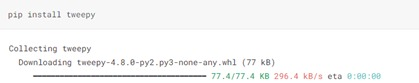  

Step 5: Authenticate with your credentials, which we can get once we have registered with a developers account. This step is essential for getting our data.  
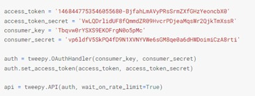

Step 6: Set up the search query containing the content related to which we want to collect the data.
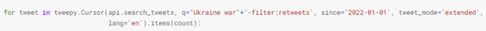  

Step 7: Collect the Tweets and append to a list  
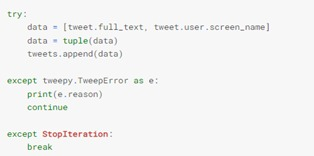  

Step 8: Create a dataset using pandas dataframe  
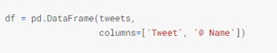 

Step 9: Convert dataset to csv file  

## Dataset (first 12 lines) after manual labelling:  
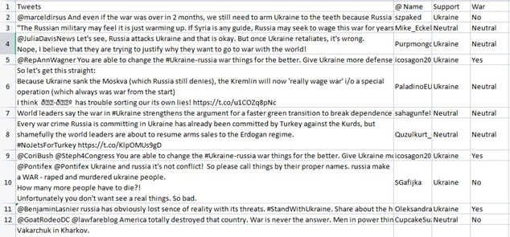   

## Algorithm:  

Step 1: START  

Step 2: Import necessary libraries and packages  

Step 3: Read the dataset and convert it into pandas data frame  

Step 4: Convert the contents of the column named “Tweets” into lower case  

Step 5: Define a list of stop words  

Step 6: Remove the stop words using the above-mentioned list  

Step 7: Remove the punctuations and special symbols  

Step 8: Remove repeating characters  

Step 9: Remove URLs/ Hyperlinks  

Step 10: Remove numerical values  

Step 11: Import nltk and download 'vader_lexicon'  

Step 12: Using nltk.sentiment.vader , import SentimentIntensityAnalyzer  

Step 13: Create a new column named “polarity scores” containing the polarities of individual tweets from our dataset using SentimentIntensityAnalyzer  

Step 14: Create a new column named “polarity” containing the overall compound polarities of the tweets  

Step 15: Print the results containing the number of tweets in favor of Russia/Ukraine and favor of War/No War  

Step 16: Divide the dataset into training (80%) and testing (20%) dataset  

Step 17: Import CountVectorizer,TfidfTransformer and MultinomialNB from 
sklearn.feature_extraction.text and sklearn.naive_bayes respectively  

Step 18: Import Pipeline from sklearn.pipeline  

Step 19: Train the columns of “Tweets” and “Support” using MultinomialNB model and the 
pipeline  

Step 20: Predict the result and compare it with “Support” and find the accuracy  

Step 21: Import SGDClassifier from sklearn.linear_model  

Step 22: Train the columns of “Tweets” and “Support” using SGDClassifier model and the 
pipeline  

Step 23: Predict the result and compare it with “Support” and find the accuracy  

Step 24: Repeat Step 19 to Step 23 for “Tweets” and “War”  

Step 25: Import metrics from sklearn  

Step 26: Print the classification report  

## Output:  

### Polarity of Tweets -  
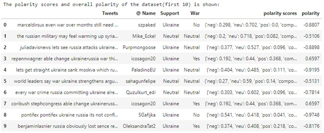   

### Number of tweets supporting Russia, Ukraine, War and No War -  
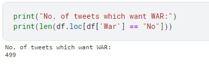   
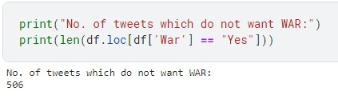  
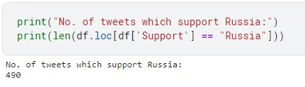  
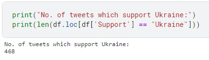   
## Prediction Results - Accuracy measured:  

### Accuracy for support prediction using Multinomial NB -  
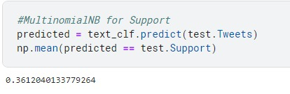   

### Accuracy for support prediction using SGD Classifier -  
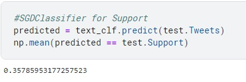   

### Accuracy for War prediction using Multinomial NB -  
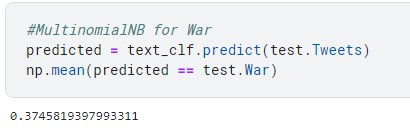   

### Accuracy for War prediction using SGD Classifier -  
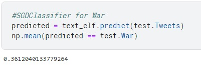  

### Confusion Matrix -  
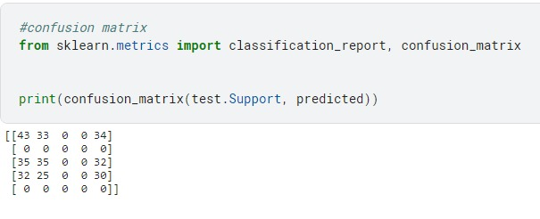   

### Classification Report -  
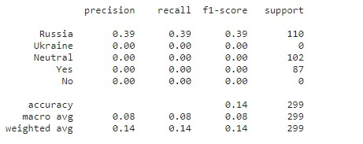   

## Conclusion:
● For Support for Russia/Ukraine, SGDClassifier gives better accuracy
● For Support for War (Yes/No), MultinomialNB gives better accuracy
● No. of tweets which want WAR: 499
● No. of tweets which do not want WAR: 506
● No. of tweets which support Russia: 490
● No. of tweets which support Ukraine: 468

